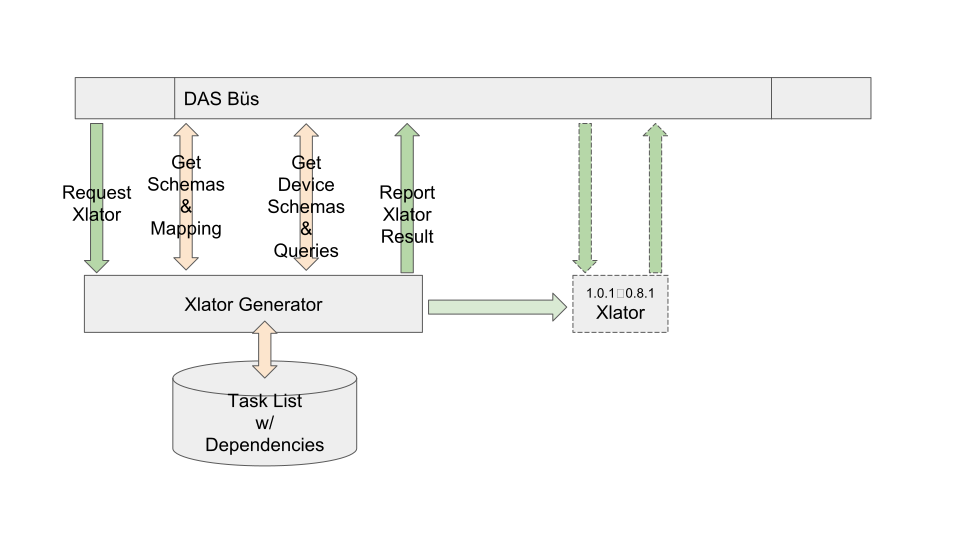
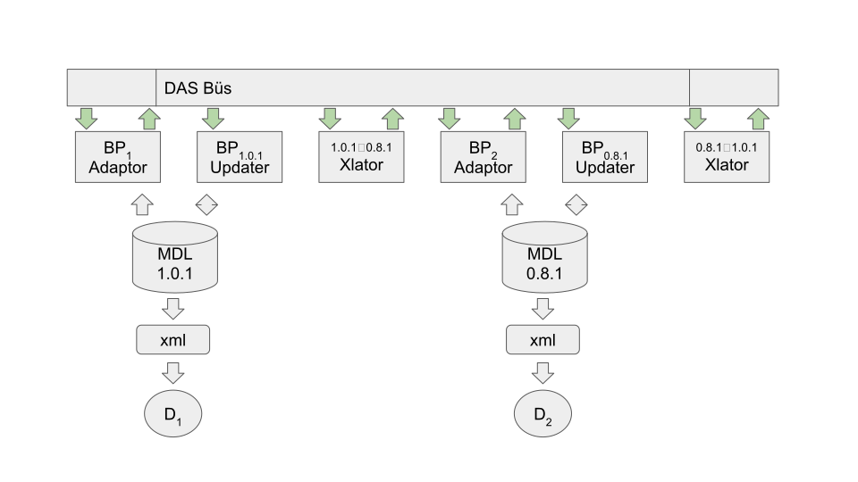

# BRASS Scenario 6 : Natural Adaptation to MDL Schema Evolution

## Overview

Every application is based on some ontology.
The data that conforms to that ontology is represented as a schema.
A schema realizes an ontology by expressing a specific ontology conforming structure.  
Realization both embellishes and simplifies.

Generally the ontology of a system can be considered static 
throughout the development process.
In the long run, i.e. 100yr software, the ontological perspective changes.
The technology upon which that ontology is realized also evolves.
Together these two pressures cause substantial changes to the schema.
What are the artifacts that adapt in response to these schema changes?

An MDL message (file) provides configuration information to various devices.
Each device's requirements can be modeled as a query, 
a mapping from the MDL schema to the implicit schema had by the device.
If two MDL schema versions are monomorphic then all is copacetic, 
a direct translator can be generated and any queries will work correctly.
If the mapping is isomorphic it is necessarily monomorphic in both directions.
However it is likely that a new schema is richer in some way than its predecessor;
it is monomorphic only from old to new, the inverse mapping having some ambiguity.
This ambiguity may or may not adversely affect a query; 
it would be useful to know if the composition of the query and the 
schema mapping is "correct".

The triggering event is a translator-generation-request.
That xlator-request-event presumes the existence of several artifacts.

The xlator-result-report describes successful/failure for each of the 
artifacts requested or resources required.

An MDL message will be automatically translated by the running translator.

# MDL Message Translation

The primary goal is to translate MDL configuration messages.
One such translator is generated for each pair of schema versions.
For the purpose of this discussion let us choose two arbitrary schema S and T.
Currently this translator is written in a somewhat declarative form in XSLT.
The translator, X:S->T, is realized based on a mapping between S and T.

Consider the 

## Universal Condition

The following are barrier conditions.

### Precondition : A pair of Schema are known

The assumptions here are that a previous MDL schema is present.
The triggering event is the arrival of mapping between schema pairs.

### Postcondition : Wherein A Device Properly Changes its Behavior

A translator is produced which responds to message events of a 
certain type by converting the message to an alternate version and 
publishing that message.

## A Request for an MDL Configuration Message Translator

Produce a translator that will subscribe to messages of a certain type and version.
From that message will be produced a message of a target type and version.

## A Request for an MDL Device Query Translator

Produce a translator that will subscribe to messages of a certain type and version.
From that message will be produced a query representing a particular device type and version.

## A Request to Check an MDL Configuration Message is Device Compatible

Evaluate a translator, used for a certain message type and version,
to determine if its output message will be adequate for a particular device.
