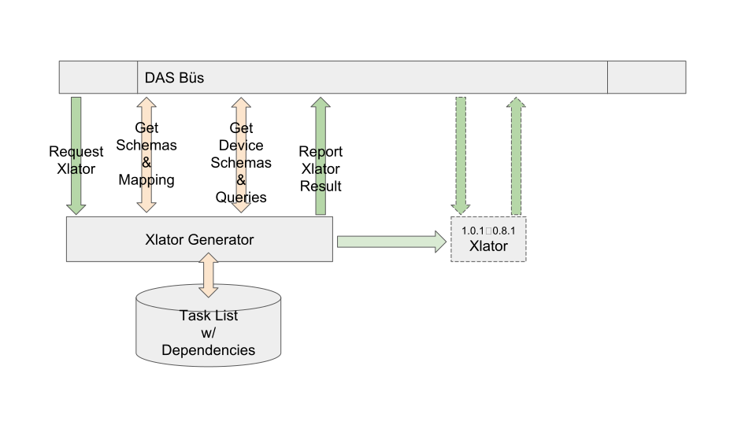
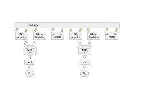

# BRASS Scenario 6 : Natural Adaptation to MDL Schema Evolution

The triggering event is a translator-generation-request.
That xlator-request-event presumes the existence of several artifacts.

The xlator-result-report describes successful/failure for each of the 
artifacts requested or resources required.

An MDL message will be automatically translated by the running translator.

# Generation of MDL Message Translators

Generates MDL configuration message translators.
One such translator is generated for each pair of schema versions.
The triggering event is a request to produce a translator, 
minimally, between a schema pair.

## Universal Condition

The following are barrier conditions.

### Precondition : A pair of Schema are known

The assumptions here are that a previous MDL schema is present.
The triggering event is the arrival of mapping between schema pairs.

### Postcondition : Wherein A Device Properly Changes its Behavior

A translator is produced which responds to message events of a 
certain type by converting the message to an alternate version and 
publishing that message.

## A Request for an MDL Configuration Message Translator

Produce a translator that will subscribe to messages of a certain type and version.
From that message will be produced a message of a target type and version.

## A Request for an MDL Device Query Translator

Produce a translator that will subscribe to messages of a certain type and version.
From that message will be produced a query representing a particular device type and version.

## A Request to Check an MDL Configuration Message is Device Compatible

Evaluate a translator, used for a certain message type and version,
to determine if its output message will be adequate for a particular device.
