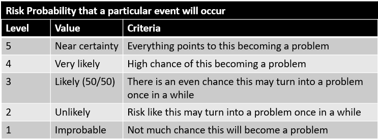
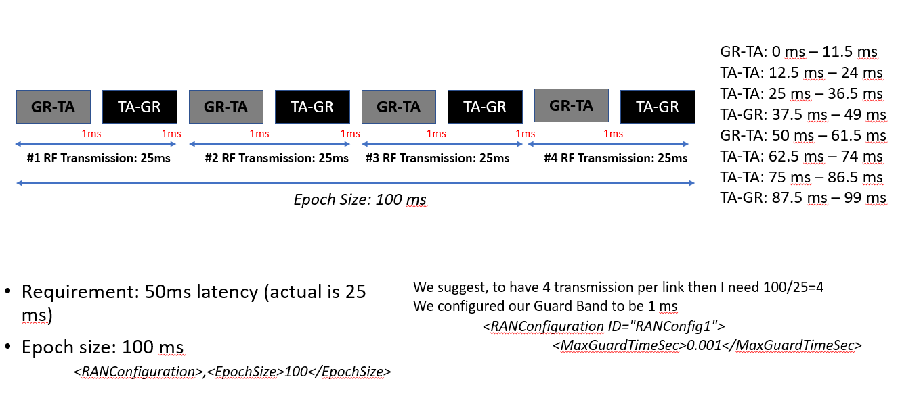

title: FT Scenario 1
class: animation-fade
layout: true
<!-- This slide will serve as the base layout for all your slides -->

.bottom-bar[
  {{title}}
]

---

class: impact

# {{title}}
## Mission Suddenly Requires High Bandwidth For Safety of Flight Data
## F-22 Coating Upgrades
### Adapted from a flight test that occurred in 2005

---

# Brief Description
.col-8[
A fighter has a mission with a fixed scheduled transmission bandwidth. During the flight test, flight crew encountered heavy vibration. As a result, the requirement for safety data increased to make sure everything is fine. Now the mission needs a higher amount of bandwidth to be able to send the safety data down to the ground station, in order to continue to fly. For this scenario, range bandwidth is available.

Voice and safety data need to be guaranteed for the test mission to be successful.
]

.col-4[

]

---

# Test Article

.col-4[
Aircraft: F-22 Raptor
]

.col-8[

]

---

# Range Infrastructure

.col-6[
- Range Network: 
	- Typically large military range e.g. Edwards Air Force Flight Test Center
- Equipment Used:
	- Ground Station Tracking Antenna and related network infrastructure
	- MCR Processing live data
- Equipment Available:
	- All in use
]

.col-6[

]

---

# Static Scheduling

Before the start of the mission the radios are individually configured for the described test mission with the following QoS (Quality of Service):

-  Voice and safety needs to be guaranteed during the entire mission
    -  Voice: 50 Kb/s
    -  Safety: 100 Kb/s
-  Bulk: 1000 Kb/s

---

# Flight Test Operation Flow

---

# Associated Constraints

- Physical limit on amount of bandwidth that can be achieved

- Schedule must be valid

- Latency should be constrained under 50ms

---

# Cost Metrics

Cost For Retrofit = Cost Per Flying Hour (CPFH) * X + Other Costs

--- 
<!-- purposeful space after the marker above to leave it in the slide -->

**CPFH:**
Cost per Flying Hour (Well-known DoD cost metric) which includes Operating and Support costs such as Fuel, Consumables, and Maintenance costs

**Other Costs:** 
Instrumentation Cost ($0) + Test Planning (~$0) + Roll Out Cost + Scheduling Cost + Post Flight Analysis (~$0)

CPFH For the F-22 Raptor: **$58,059.00**

Assumptions: 
1. Aircraft was already instrumented 
2. We approximate the Rollout Costs and Scheduling Costs to be about the cost of an hour of flight

---

# Cost Metric Instantaneous Cost

.col-4[
- Unadapted - FT mission encountered a problem after T=3 which required landing and repeating the test again

- Adapted - FT mission was accomplished successfully without having to land
]

.col-8[

]

---

# Cost Metric Cumulative Cost

---

# Program Value Function

.col-4[
- Maneuver value is the purpose of the flight test

- Flight value is some value gained by having the plane in the air
]

.col-8[

]

---

# Program Value Function

---

# Risk Metric

.col-4[
- Measures the future uncertainties in achieving the test mission within the defined cost and schedule constraints
]

.col-8[

]

---

# Risk Metric

---

# Requirement Changes after Event Happens

| 		   |      Requirements Before Event      |  Requirements After Event |
|----------|-------------------------------------|---------------------------|
| Voice    | 50 Kb/s      						 | 50 Kb/s                   |
| Safety   | 100 Kb/s                            | 150 Kb/s                  |
| Bulk     | 1000 Kb/s                           | 1000 Kb/s                 |

---

# QoS Policies

- Where is QoS Policy defined in MDL?
  
  `<TestMission>\<QoSPolicy>\<ServiceLevelProfiles>`

- The Mission Service Level Profiles (MSLP) are defined for each link to handle Quality of Service (QoS) IP routing across the RF links that are defined for radio to radio wireless RF communication

- Each MSLP defines a specific set of rules for IP routing that are applied to the RadioLink that is referenced

---

# Priority Levels

---

# QoS Policy in MDL

Where do we set the QoS Policies for the uplink and downlink radio link? 

---

# Voice Requirement in MDL

---

# Safety Requirement in MDL (Before)

---

# Safety Requirement in MDL (After)

---

# Classic Solution

- Land and abort test
    - Increases cost of testing because we will have to start the test over
    - Impacts flight test schedule

- No MDL changes needed for this solution

---

# Suggested Solution

- MDL Reconfiguration
	- RadioLink element is where most of the changes need to be done for both Radio (TA and Ground)
		- Describes a one-way connection two radio point
		- TransmissionSchedule element which describes the scheduling parameters for a static schedule 
		- In this case we need to schedule TxOp assignment for the TA Radio and the Ground Radio as appropriate for the scenario requirement change

---

# TA Radio MDL Configuration (Before)

---

# Ground Radio MDL Configuration (Before)

---

# TA Radio MDL Configuration (After)

---

# Ground Radio MDL Configuration (After)

---

# Transmission Schedule Before Adaptation

---

# Transmission Schedule After Adaptation

---

# Rules

- We presented one sample transmission schedule 

- Others can also be an option as long as it meets the latency requirement

---

# Sources

- https://www.pmi.org/learning/library/project-management-cost-estimate-costs-5256
- http://www.businessinsider.com/air-force-plane-cost-per-flight-hour-chart-2016-3
	- F22 and F35 
- http://nation.time.com/2013/04/02/costly-flight-hours/
- https://www.rand.org/content/dam/rand/pubs/research_reports/RR1100/RR1178/RAND_RR1178.pdf