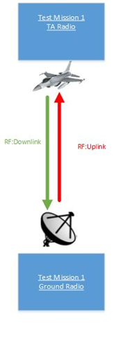
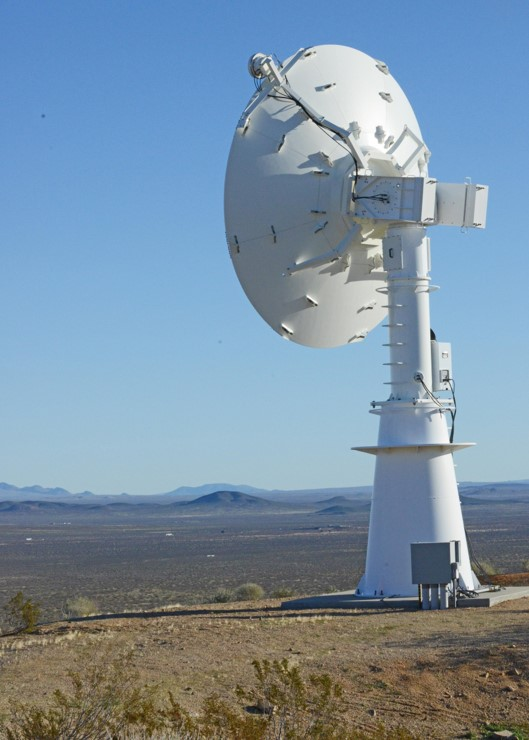
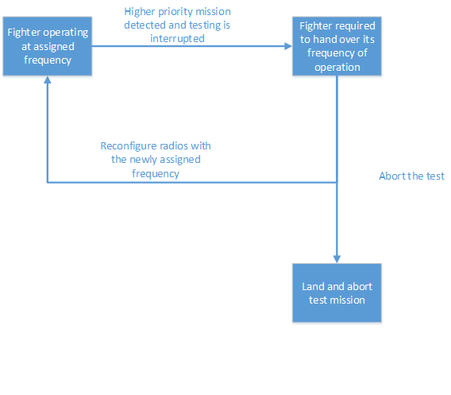
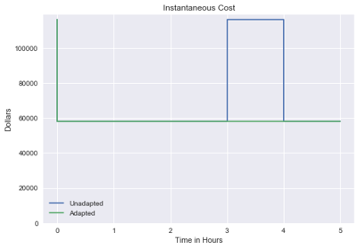
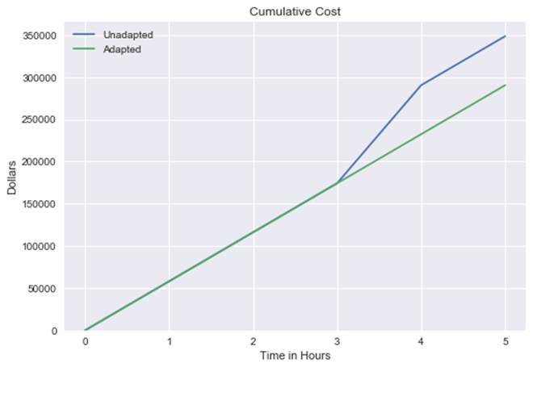
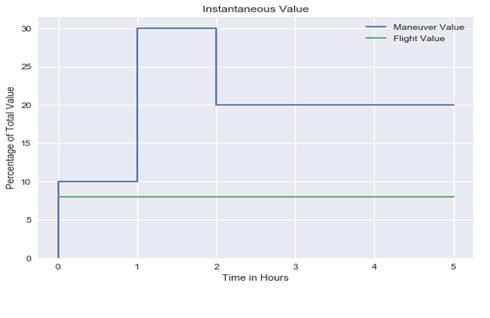
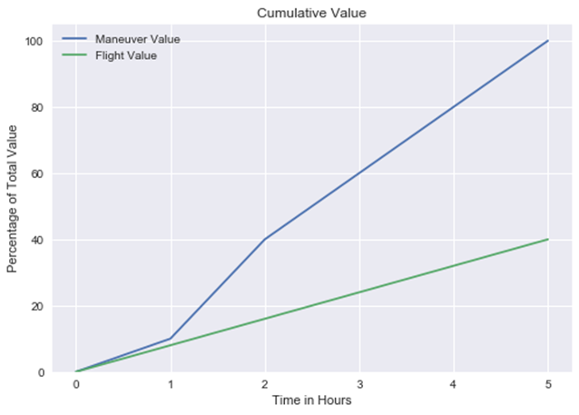
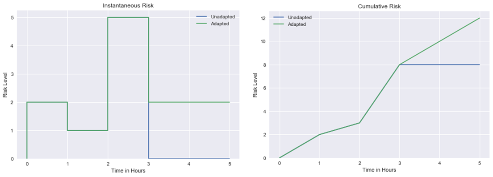
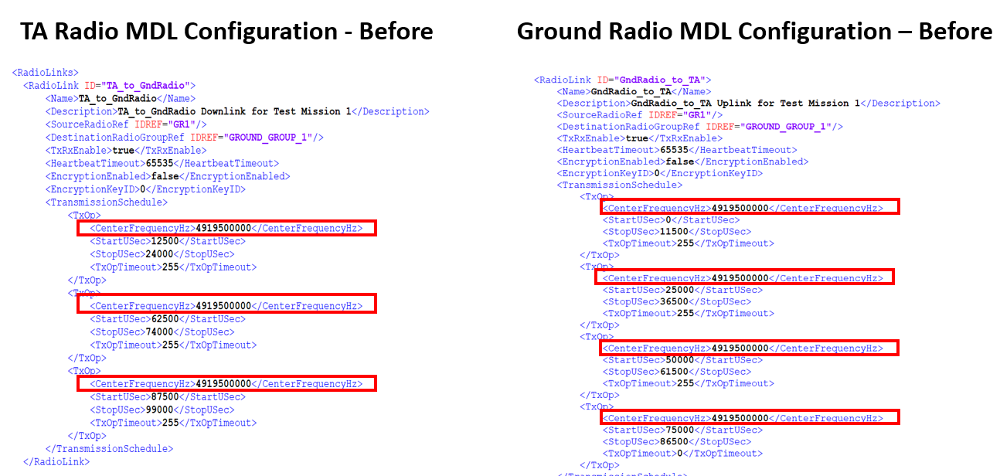
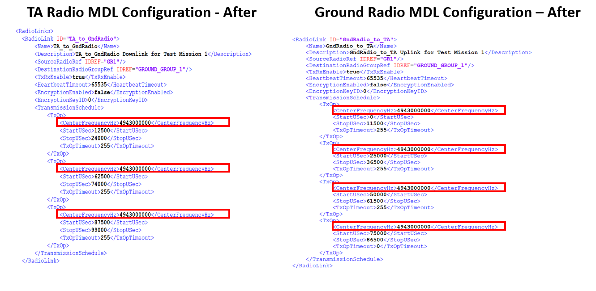

title: FT Scenario 2
class: animation-fade
layout: true
<!-- This slide will serve as the base layout for all your slides -->

.bottom-bar[
  {{title}}
]

---

class: impact

# {{title}}
## Mission Suddenly Requires to Change Frequency of Operation
## F-22 Coating Upgrades
### Adapted from a flight test that occurred in 2005

---

# Brief Description
.col-8[
A fighter is operating at an assigned frequency. Testing is interrupted when another higher priority mission needs to use the same frequency. To accommodate the higher priority mission, the assets associated with the fighter must be reconfigured immediately at a newly assigned frequency. 

]

.col-4[

]

---

# Test Article

.col-4[
Aircraft: F-22 Raptor
]

.col-8[

]

---

# Range Infrastructure

.col-6[
- Range Network: 
	- Typically large military range e.g. Edwards Air Force Flight Test Center
- Equipment Used:
	- Ground Station Tracking Antenna and related network infrastructure
	- MCR Processing live data
- Equipment Available:
	- All in use
]

.col-6[

]

---

# Static Scheduling

Before the start of the mission the radios are individually configured for the described test mission with the following QoS (Quality of Service):

-  Voice and safety needs to be guaranteed during the entire mission
    -  Voice: 50 Kb/s
    -  Safety: 100 Kb/s
-  Bulk: 1000 Kb/s

---

# Flight Test Operation Flow

---

# Associated Constraints

- Physical limit on amount of bandwidth that can be achieved

---

# Cost Metrics

Cost For Retrofit = Cost Per Flying Hour (CPFH) * X + Other Costs

--- 
<!-- purposeful space after the marker above to leave it in the slide -->

**CPFH:**
Cost per Flying Hour (Well-known DoD cost metric) which includes Operating and Support costs such as Fuel, Consumables, and Maintenance costs

**Other Costs:** 
Instrumentation Cost ($0) + Test Planning (~$0) + Roll Out Cost + Scheduling Cost + Post Flight Analysis (~$0)

CPFH For the F-22 Raptor: **$58,059.00**

Assumptions: 
1. Aircraft was already instrumented 
2. We approximate the Rollout Costs and Scheduling Costs to be about the cost of an hour of flight

---

# Cost Metric Instantaneous Cost

.col-4[
- Unadapted - FT mission encountered a problem after T=3 which required landing and repeating the test again

- Adapted - FT mission was accomplished successfully without having to land
]

.col-8[

]

---

# Cost Metric Cumulative Cost

---

# Program Value Function

.col-4[
- Maneuver value is the purpose of the flight test

- Flight value is some value gained by having the plane in the air
]

.col-8[

]

---

# Program Value Function

---

# Risk Metric

.col-4[
- Measures the future uncertainties in achieving the test mission within the defined cost and schedule constraints
]

.col-8[

]

---

# Risk Metric

---

# Classic Solution

- Land and abort test
    - Increases cost of testing because we will have to start the test over
    - Impacts flight test schedule

- Stay in the air and perform other tests until the frequency is available 
	- Assuming other tests can be performed while in flight

- No MDL changes needed for this solution

---

# Suggested Solution

- MDL Reconfiguration
	- <RadioLink> element is where most of the changes need to be done for both Radio (TA and Ground)
	- Describes a one-way connection two radio point
	- <TransmissionSchedule> element which describes the scheduling parameters for a static schedule 
	- In this case we need to change the <CenterFrequencyHz> value to the new allocated frequency change

---

# TA/Ground Radio MDL Configuration (Before)

---

# TA/Ground Radio MDL Configuration (After)

---

# Sources

- https://www.pmi.org/learning/library/project-management-cost-estimate-costs-5256
- http://www.businessinsider.com/air-force-plane-cost-per-flight-hour-chart-2016-3
		- F22 and F35 
- http://nation.time.com/2013/04/02/costly-flight-hours/
- https://www.rand.org/content/dam/rand/pubs/research_reports/RR1100/RR1178/RAND_RR1178.pdf
- https://scout.com/military/warrior/Article/Air-Force-F-22-Conducts-Operational-Testing-of-New-Weapons-Tech-109177127
