title: FT Scenario 3
class: animation-fade
layout: true
<!-- This slide will serve as the base layout for all your slides -->

.bottom-bar[
  {{title}}
]

---

class: impact

# {{title}}
## Sensor Failure
## Structural Strain Test
### Adapted from a flight test that occurred in February 1977

---

# Brief Description
.col-8[

The objectives of the tests are to measure the strain on the tail boom of the AH-1G Helicopter.

The tests were conducted at Edwards Air Force Base, California.

Three sensors are mounted at the positions shown in the picture. During flight test, the sensor mounted in position 3 failed.

We assume that we are using the same scenario with modern and network based instrumentation.  

]

.col-4[
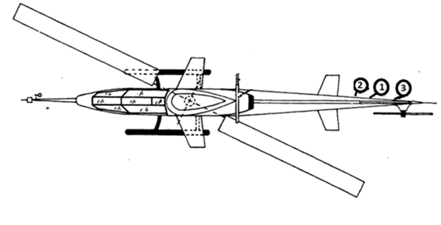
]

---

# Test Article

.col-4[
- Aircraft: AH-1G Helicopter also referred to as HueyCobra or Snake
- Historical backbone of the US Army's Attack helicopter fleet
- Since upgraded versions continue to fly with the militaries of several other nations, testing programs continue to this day

]

.col-8[
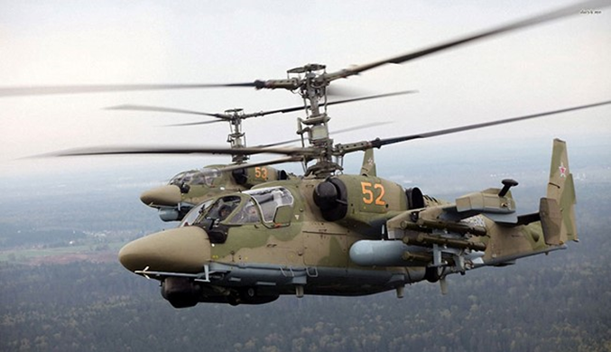
]

---

# Range Infrastructure

- Range Network: 
	- Edwards Air Force Base, California
- Equipment Used:
	- Ground Station Tracking Antenna and related network infrastructure
	- MCR Processing live data
- Equipment Available:
	- All in use

---

# Flight Test Operation Flow

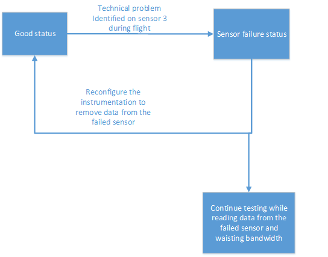

---

# Associated Constraints

- The sample rates are tiered at powers of 2
	- Adding a fourth sensor would not have changed the sample rate; however the installation cost was high enough that the additional sensor data was not worth the tradeoff

---

# Cost Metric: Bandwidth versus Time 
# Instantaneous Cost

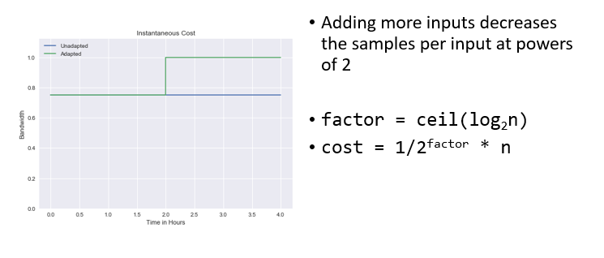

---

# Cost Metric: Bandwdith versus Time
# Cumulative Cost

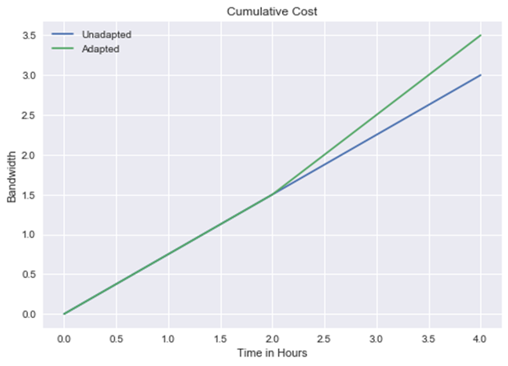

---

# Program Value Function
# Device Input Function

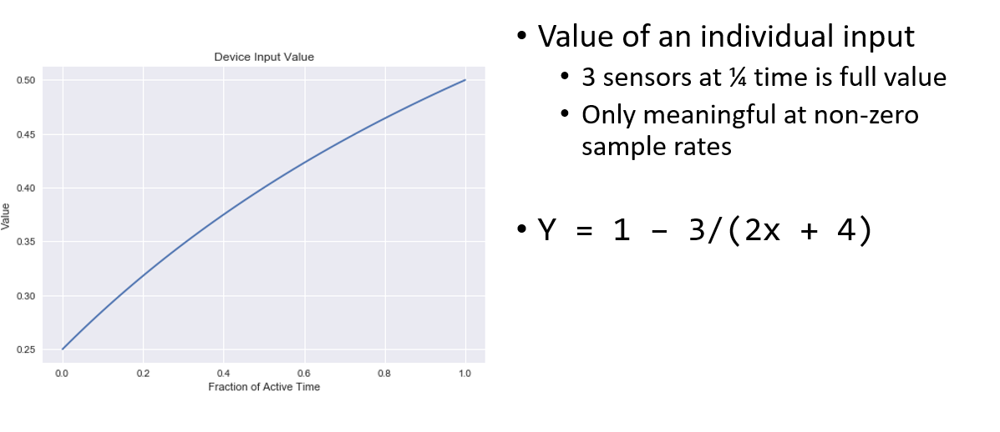

---

# Program Value Function
# Instantaneous Value

.col-4[
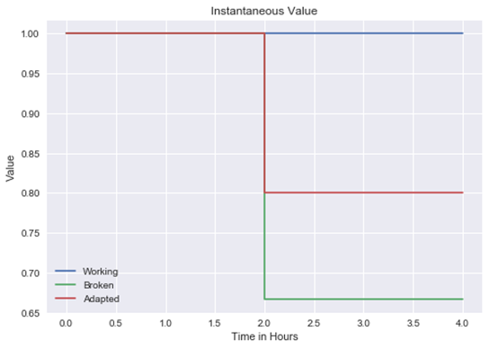
]

.col-8[
- Device sample rate increases as number of inputs decreases
- Individual input value goes up with higher sample rates
- Working -- 3 inputs, all on
- Broken -- 3 inputs, 2 on
- Adapted -- 2 inputs, all on
]

---

# Program Value Function
# Cumulative Value

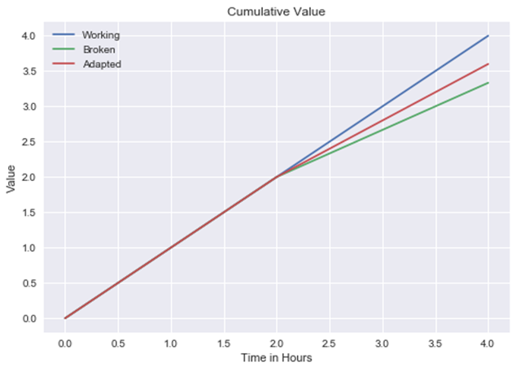

---

# Risk Metric

- Measures the future uncertainties in achieving the test mission within the defined cost and schedule constraints

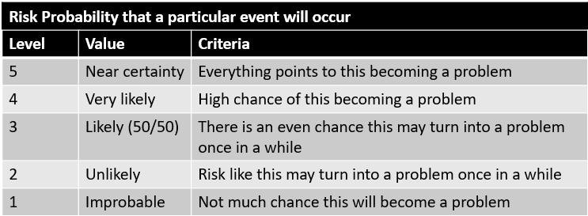

---

# Risk Metric: Instantaneous Risk

.col-4[
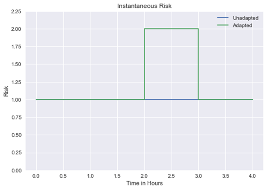
]

.col-8[
 - Base risk is 1
 - Risk during reconfiguration is 2
 	- Device may not come back up
]

---

# Risk Metric: Cumulative Risk

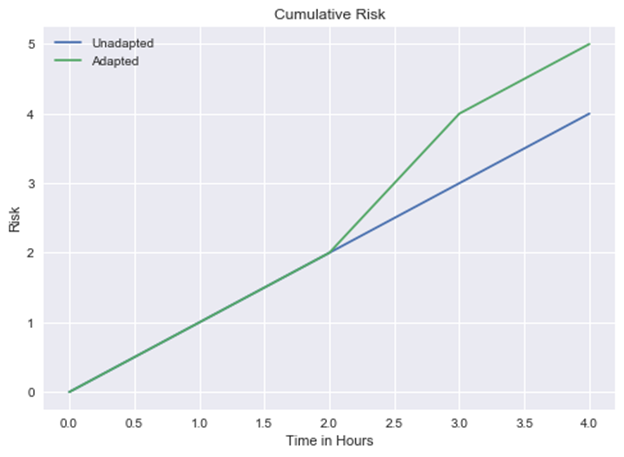

---
# Classic Solution

- Ignore failure to avoid reconfiguring
	- Trades stability for increased sample rates on remaining sensors

- No MDL changes needed for this solution

---

# Suggested Solution

- Reconfigure to drop the failed sensor data 
- MDL Reconfiguration
	- This setup describes a DAU that is composed of 3 modules, where its ports are connected to 3 different sensors
	- There  are 3 measurements mapped to the 3 sensors
	- After sensor failure is identified, we need to reconfigure the DAU to only look at sensor 1 and 2

---

# Instrumentation

.col-4[
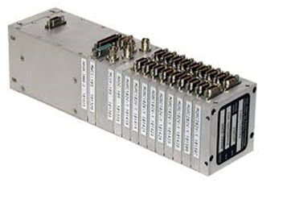
]

.col-8[
 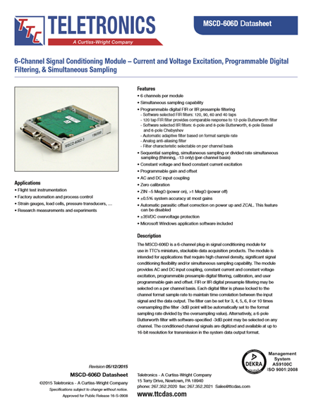
]

---

# MDL Configuration - Measurements

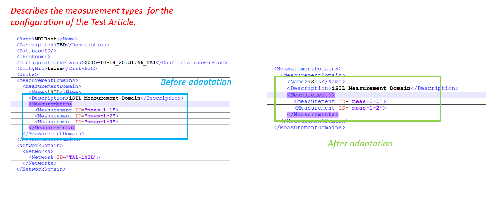

---

# MDL Configuration - Sample Rate Description

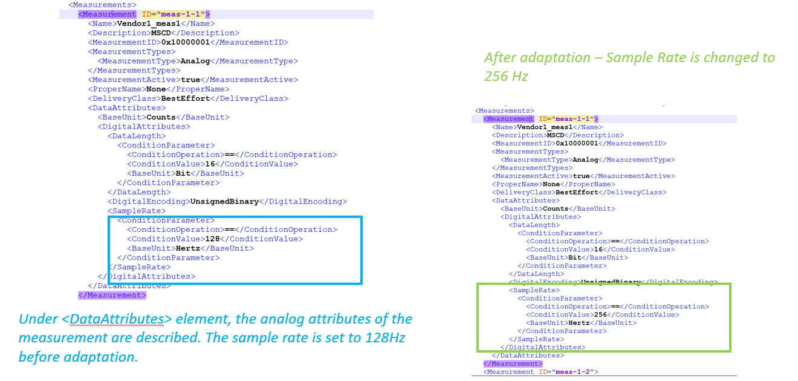

---

# MDL - DAU Description

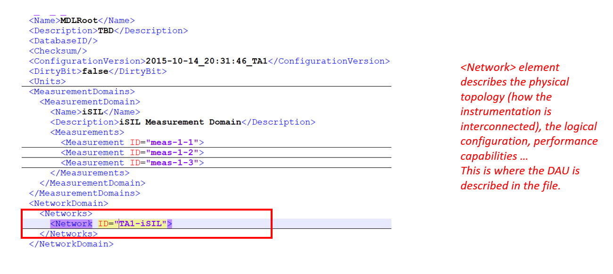

---

# MDL - DAU Description

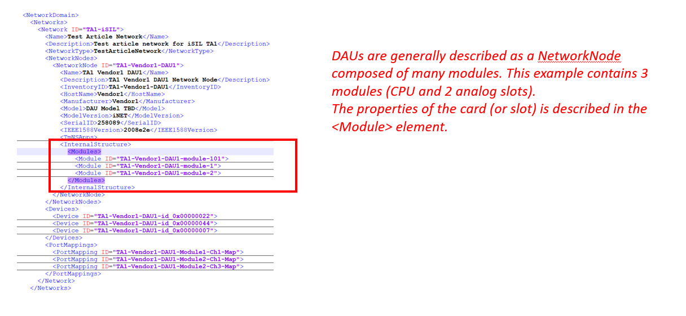

---

# MDL - Sensors Description

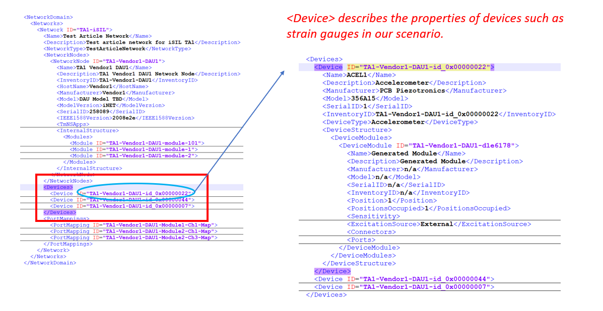

---

# MDL - Port Description

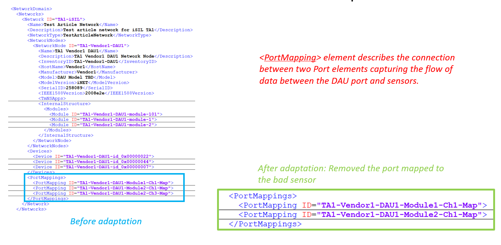

---

# Sources

- http://www.dtic.mil/dtic/tr/fulltext/u2/a044327.pdf