title: FT Scenario 4
class: animation-fade
layout: true
<!-- This slide will serve as the base layout for all your slides -->

.bottom-bar[
  {{title}}
]

---

class: impact

# {{title}}
## Relay Scenario
 
### Adapted from a flight test that occurred in July 1989

---

# Scenario Description

A relay is using one aircraft to transmit data from one aircraft to another such that the aircraft of interest need not be accessible directly by ground antenna.
The scenario involves a single radio on the ground network, a single radio on a relay network (TA1), and a single radio on TA2 network as shown in the next slide. During the scenario the TA1 relay is needed for another priority mission so we need to adapt by using available assets to preserve the transmission of data in the case TA2 is outside the transmission range. 
In this scenario the transmission schedule is fixed for all radios in the scenario.
How can the transmission be preserved when the aircraft is outside the transmission range of the ground radio without losing end-to-end communication?

---

# Scenario Description

.col-8[
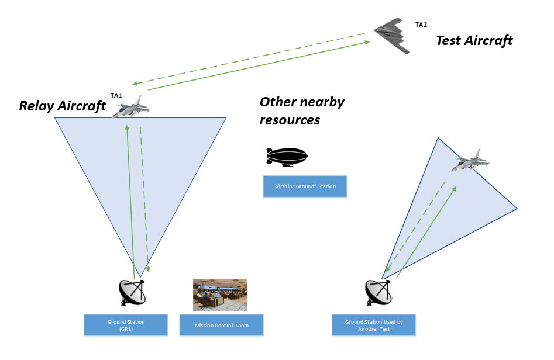
]

.col-4[
TA1 is configured to be the relay when TA2 is out of range of the ground radio as shown here
]

---

# Scenario Description

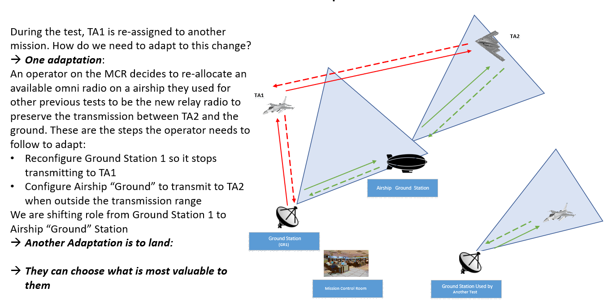

---

# Test Article

.col-4[
Aircraft: B-2 Bomber
]
.col-8[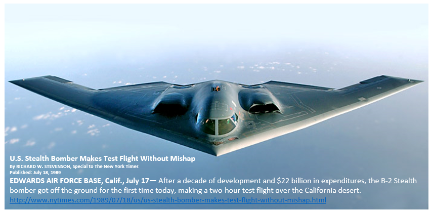
]

---

# Range Infrastructure

- Range Network: 
	- Typically large military range e.g. Edwards Air Force Flight Test Center
- Equipment Used:
	- Ground Station Tracking Antenna and related network infrastructure
	- MCR Processing live data
- Equipment Available:
	- Airship "Ground" Station
	- Others are all in use 

---

# Flight Test Operation Flow

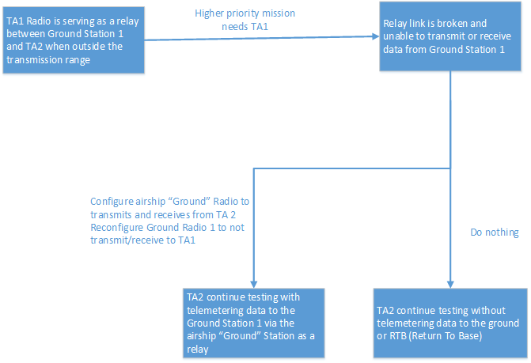

---

# Static Scheduling

Before the start of the mission the radios are individually configured for the described test mission with the following QoS (Quality of Service)
	- Voice: 50 Kb/s
	- Safety: 100 Kb/s
	- Bulk: 1000 Kb/s

---
# Transmission Schedule

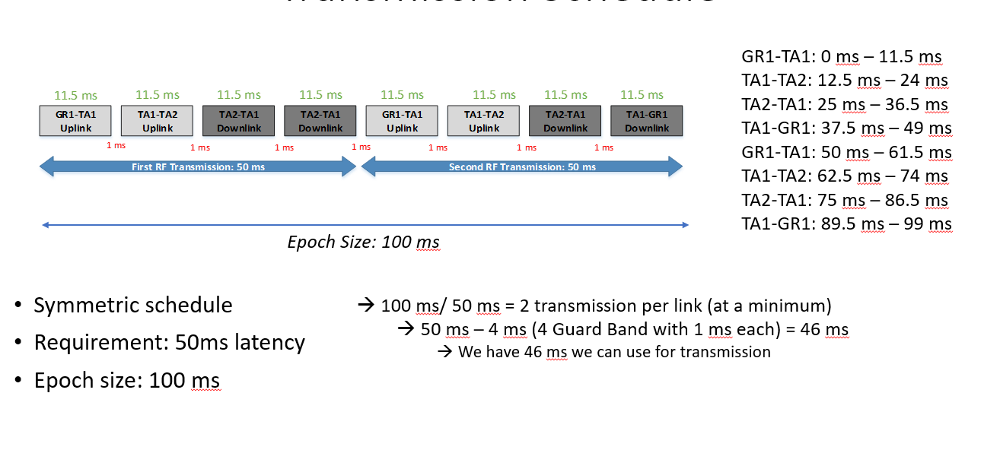

---

# Associated Constraints

- Physical limit on amount of bandwidth that can be achieved

- Schedule must be valid

---

# Cost Metrics

Cost For Retrofit = Cost Per Flying Hour (CPFH) * X + Other Costs

--- 
<!-- purposeful space after the marker above to leave it in the slide -->

**CPFH:**
Cost per Flying Hour (Well-known DoD cost metric) which includes Operating and Support costs such as Fuel, Consumables, and Maintenance costs

**Other Costs:** 
Instrumentation Cost ($0) + Test Planning (~$0) + Roll Out Cost + Scheduling Cost + Post Flight Analysis (~$0)

CPFH For the F-22 Raptor: **$58,059.00**

Assumptions: 
1. Aircraft was already instrumented 
2. We approximate the Rollout Costs and Scheduling Costs to be about the cost of an hour of flight

---

# Cost Metric Instantaneous Cost

.col-8[
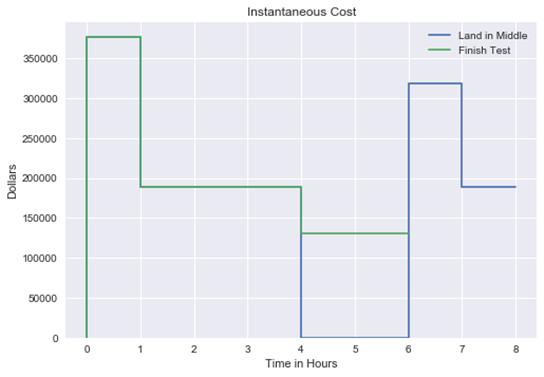
]

.col-4[
- At the start of the test, both TAs cost applies to the test
- When TA1 gets taken away, the cost no longer applies
- If landing in the middle is chosen, no costs are incurred until takeoff, when both TAs are again costing money
]

---

# Cost Metric Cumulative Cost

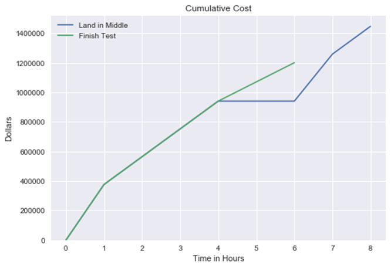

---

# Program Value Function
# Component Instantaneous Value

.col-4[
- Maneuvers are worth their percentage value when performed
- Real time data is worth a constant value]

.col-8[
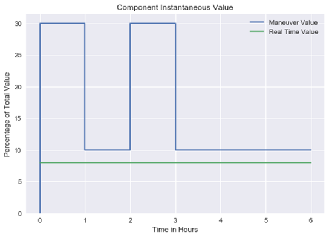
]

---

# Program Value Function
# Component Cumulative Value

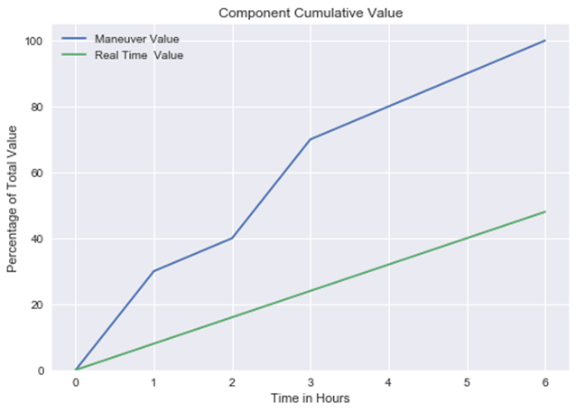

---

# Program Value Function
# Total Instantaneous Value
.col-4[
 - Land in middle delays all value until TA1 becomes available again
- Adapted tactic redirects telemetry to the airship, so all value is gained
- No telemetry elects to drop all real-time telemetry
]
.col-8[
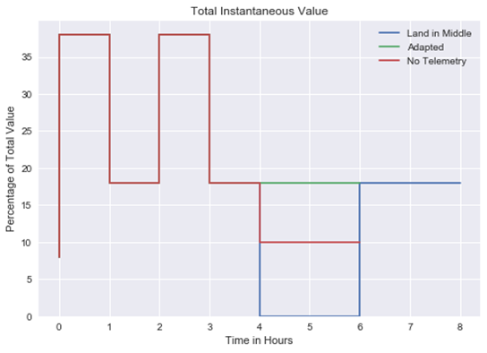
]
---

# Program Value Function
# Total Cumulative Value

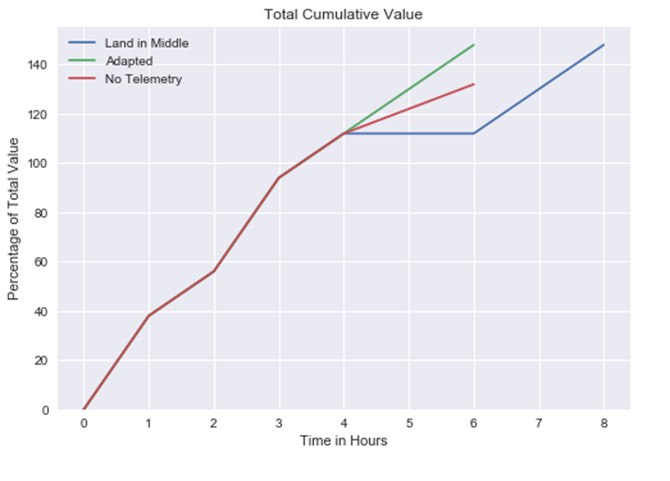

---

# Risk Metric

.col-4[
- Measures the future uncertainties in achieving the test mission within the defined cost and schedule constraints
]

.col-8[

]

---

# Risk Metric

---

# Risk Metric 
# Instantaneous Risk
.col-4[
- Land in middle introduces no extra risk
- Adapted tactic introduces a small reconfigure risk for setting up the new schedule
- No telemetry, without real-time flight data, is riskier as safety of flight data cannot be monitored outside of the test article

]

.col-8[
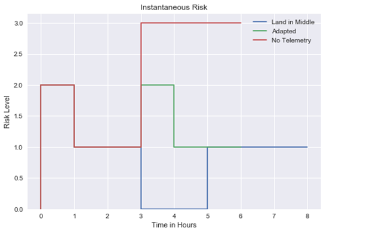
]

---

# Risk Metric 
# Cumulative Risk

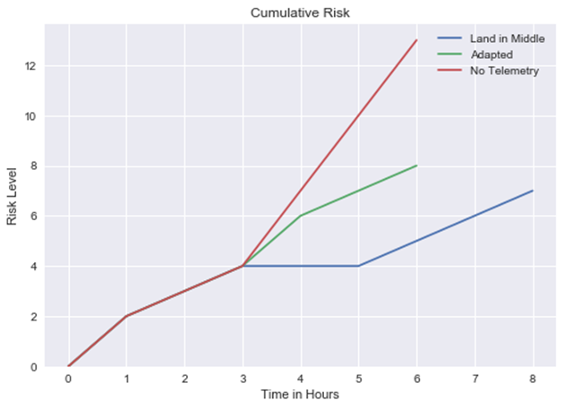

---

# Classic Solution

- Return To Base and finish when TA1 is available

- No MDL changes needed for this solution

---

# Suggested Solution

- MConfigure the Airship “Ground” Radio to transmit to TA2
- Reconfigure Ground Radio 1 to STOP transmitting to TA1
	- We don’t want to waste bandwidth

---

# MDL Configuration (Before)

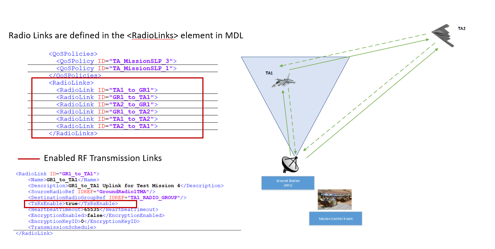

---

# MDL Configuration 
# GR1 to TA1 RF Uplink

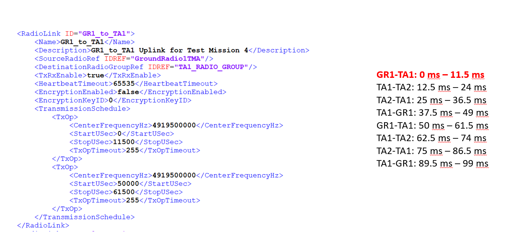

---

# Transmission Schedule
# TA1 to TA2 RF Uplink

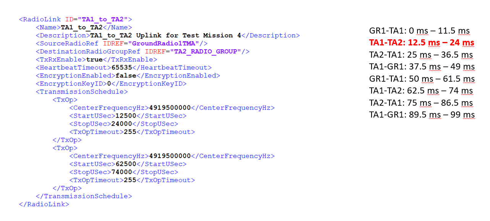

---

# Transmission Schedule
# TA2 to TA1 RF Downlink

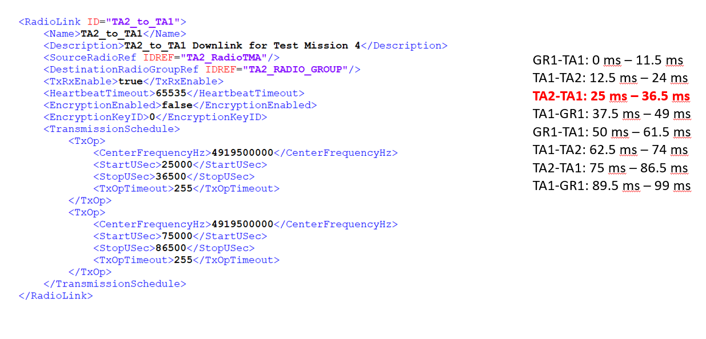

---

# Transmission Schedule
# TA1 to GR1 RF Downlink

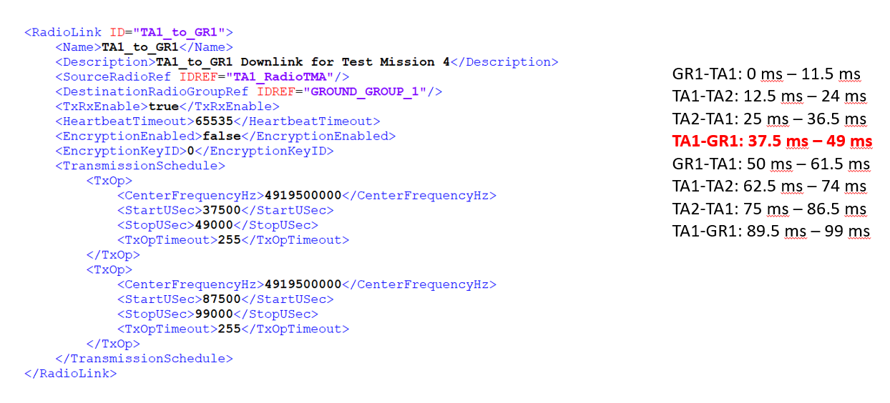

---

# MDL Configuration (After)

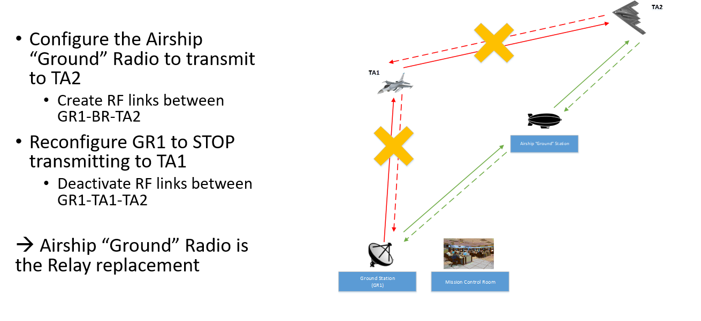

---

# MDL Configuration (After)

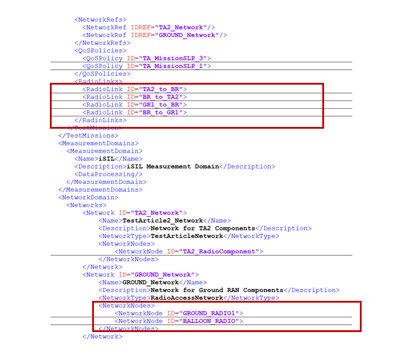

