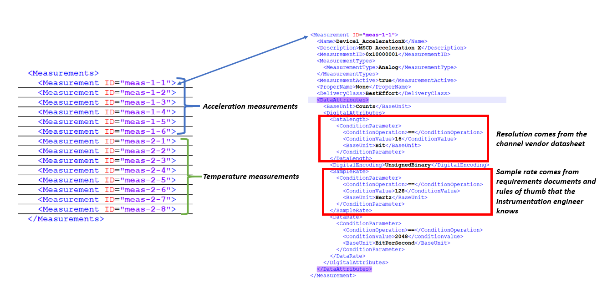
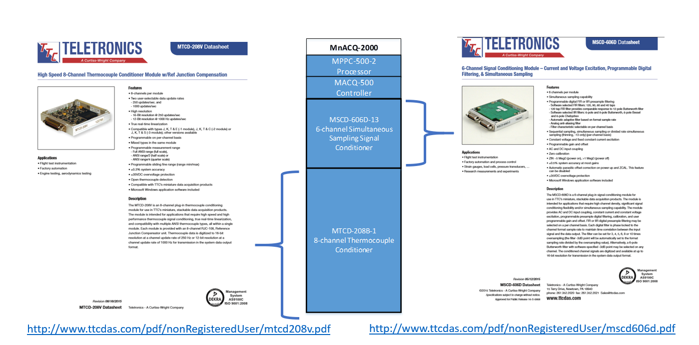

title: FT Scenario 5
class: animation-fade
layout: true
<!-- This slide will serve as the base layout for all your slides -->

.bottom-bar[
  {{title}}
]

---

class: impact

# {{title}}
## Swap Data Acquisition Unit 

### Adapted from a flight test that occurred in 2012 in F-35 Lightning flight testing at NAS Patuxent River

---

# Brief Description
.col-8[
This scenario describes a pre-flight situation that involves swapping instrumentation hardware in the test article. The Data Acquisition Unit (DAU) is broken and needs to be replaced by another DAU already in stock from a different manufacturer. 
The objective is to configure the new DAU to meet the same requirements as the previous one. 
]

.col-4[

]

---
# Test Article Network

---

# Test Article

Aircraft: F-35B

---

# Range Infrastructure

.col-6[
- Range Network:
	- Naval Air Station  Patuxent River (known as NAS Pax River)
- Equipment Used:
	- GSE (Ground Support Equipment)
- Equipment Available:
	- Replacement DAU
]

.col-6[

]

---

# Flight Test Operation Flow

---

# Test Objective
## Configure Replacement DAU

- Initial configuration/requirements for the TTC DAU 
	- Sample Rate: 128 Hz
    - Data Length: 16-bit Resolution  
    - 8-channel thermocouple card
    - 6-channel signal conditioner card

- New configuration/requirements for the Vendor B DAU Replacement
    - Sample Rate: 100 Hz
    - Data Length: 8-bit Resolution
    - 4-channel thermocouple card (Quantity: 2)
    - 2-channel signal conditioner card (Quantity: 3) 

---

# Initial MDL Representation

---
# Initial MDL Representation
## TTC DAU Internal Structure

---

# Initial MDL Representation
## Measurements

---

# TTC DAU Datasheet

---

# Data Acquisition Unit Modules

---

# Sensors

---

# Sensors
## Accelerometer

---

# Sensors
## Thermocouple

---

# Initial MDL Representation
## Port Mappings

---

# Replacement DAU

.col-6[
- Configuration for the Vendor B DAU Replacement
	- Sample Rate: 100 Hz
    - Data Length: 8-bit Resolution
    - 2 * 4-channel thermocouple card
    - 3 * 2-channel signal conditioner card
- The objective is to configure the replacement hardware to meet the same requirements as with the TTC DAU previously used
	- Map measurements to ports and devices
	- Configure new sample rate and bit resolution
		- Vendor B capabilities are still within the requirements
]

.col-6[

]

---

# Initial MDL Representation for Vendor B DAU
## Sample Rate / Data Length

---

# Initial MDL Representation for Vendor B DAU

---

# Initial MDL Representation for Vendor B DAU

---

# Initial MDL Representation for Vendor B DAU (Port Mappings)

---

# Cost, Value and Risk

---

# Classic Solution

- Option A and B

- No MDL changes needed for this solution

---

# Suggested Solution

- Use available hardware in inventory and configure to satisfy original requirements

- MDL Configuration file needs to be updated to reflect the new hardware configuration and connections
	- Review new configuration datasheets (sample rate, data length, port connections)
	- Map measurements to ports and devices
