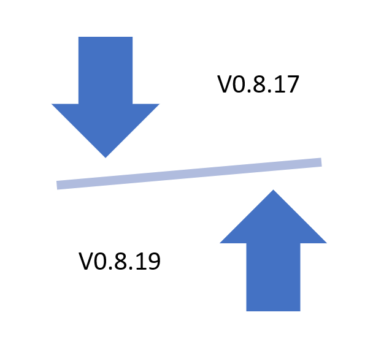

title: FT Scenario 6
class: animation-fade
layout: true
<!-- This slide will serve as the base layout for all your slides -->

.bottom-bar[
  {{title}}
]

---

class: impact

# {{title}}
## Updates to MDL Schema and Software

### Adapted from a flight test that occurred in 2015

---

# Brief Description
.col-8[
The MDL schema has updated from v0.8.17 to v0.8.19, and software is patchily adjusting for the change. The configuration management software is still on v0.8.17, but must configure and communicate with devices using v0.8.19 for the latest round of flight tests. 
]

.col-4[

]

---

# Brief Description

There must be a pathway to deliver a v0.8.19 file to the DAU from the v0.8.17 configuration manager to set up the device, and reverse the communication when exporting the configuration from the device for verification.

---

# Test Article

.col-4[
Aircraft: C-12 Huron
]

.col-8[

]

---

# Range Infrastructure

.col-6[
- Range Network: 
	- Typically large military range e.g. Edwards Air Force Flight Test Center
- Equipment Used:
	- GSE (Ground Support Equipment)
- Equipment Available:
	- Existing instrumentation hardware
]

.col-6[

]

---

# Flight Test Operation Flow

- Existing v0.8.17 configuration
- Update to v0.8.19
- Configure DAU
- Export configuration
- Downgrade to v0.8.17
---

# Associated Constraints

- Configurations must be valid for their target version

- Identical functional information must be expressed

- Textual representation will vary
 
---

# High Level Differences (From Changelog)

- Time as a measurement
    - DataAttributesType Added TimeAttributes for describing time as a Measurement
    - Added MeasurementTimeRef so a Measurement can identify the associated time Measurement
    - MeasurementTypeEnum: Added Time as an option

- Tweaked VendorConfig and GenericParameters to allow xsd:any without violating XSD 1.0 rules. 
- PortType:  Added various port attributes

- DeviceType: Fixed Sensitivity and Excitation to allow multiple ConditionParameter elements

---
# High Level Differences (From Changelog)

- Added GenericParameter to ChildType
- Updated to latest TMATS schema
- Added generic Parent/Child relationships with the Children element
- Added handoff rule strings, exact format is tbd
- Removed obsolete LinkControlMode from RadioLink
- Settled on bit for fundamental unit.  Removed Byte and BytePerSecond
- Converted many enumerations to extensible enumerations
- Describing a-priori time offsets in Packages
- InternalStructure: Generalized Module concept for all NetworkNodes and Devices, added 
- RunningApps element to describe mapping of TMAs to the modules
- ModelNumber and SerialNumber: harmonized across schema to Model and SerialIdentifier
---

# Classic Solution

- Hand update files for configuring devices
- Hand validate files exported by device

- No automatic solution
- 
---

# Suggested Solution

- Batch update/downgrade MDL files when moving between dialects

- Intercept database access calls and replace with current version equivalents (or approximations, as necessary)

---

# Supporting Files

- MDL v0.8.17 and v0.8.19 schemas and examples

- Example XSLT scripts previously used to translate between those versions
    - Explicit description of what is different between the versions
    - May be a spoiler if your techniques are looking to generate something similar e.g. based on the schema differences
    	- Bidirectional scripts do not exist for all versions of interest, so this cannot be relied on in all cases