title: FT Scenario 7a
class: animation-fade
layout: true
<!-- This slide will serve as the base layout for all your slides -->

.bottom-bar[
  {{title}}
]

---

class: impact

# {{title}}
## F-35 Testers Wrap up Weapons Delivery Accuracy Tests
### Adapted from a flight test that occurred in 2017 in F-35 Lightning flight testing at China Lake, CA

---

# Brief Description
.col-8[
This scenario describes a situation that involves two test articles initially sharing the same frequency for their missions. Suddenly, TA1 is grounded and leaves the other aircraft (TA2) with more bandwidth for the next 30 minutes.
The goal is for the airborne aircraft (TA2) to take advantage of the extra bandwidth to conduct more tests.
.col-4[
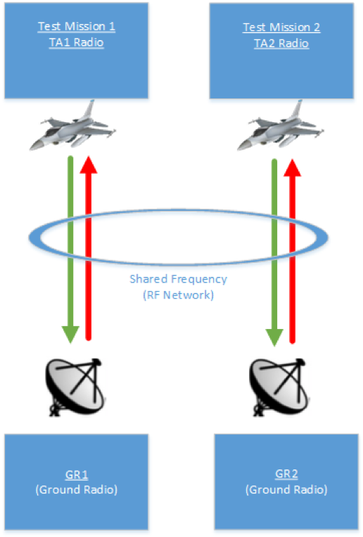
]

---

# Test Article

.col-4[
Aircraft: F-35
]

.col-8[

]

---

# Range Infrastructure

.col-6[
- Range Network: 
	- Naval Air Weapons Station at China Lake, CA
- Equipment Used:
	- Ground Station Tracking Antenna and related network infrastructure
	- MCR Processing live data
- Equipment Available:
	- All in use
]

.col-6[

]

---
# Flight Test Operation Flow

---

# Static Scheduling

- This mission depicts a scenario whose radios have transmission scheules pre-defined via MDL
  - There is no LM in this scenario
- System Manager reconfigures radio(s) to modify link utilization limitations in order to achieve desired QoS guarantees
	- Updated MDL file(s) to modify transmission schedules
	- Updated MDL file(s) to modofy QoS policies per link
---

# Requirements

- Voice and Safety-of-Flight need to be our critical data
- MDL provides static schedules 
- Bandwidth available: 10 Mb/s
    - TA1/GR1 is allocated 5 Mb/s 
    - TA2/GR2 is allocated 5 Mb/s
    - When TA1 is grounded, then TA2 and GR2 will need to be reconfigured to reallocate all bandwidth to the TA2/GR2 test mission.
- latency requirement: 100 ms

---

# Test Mission Description in MDL

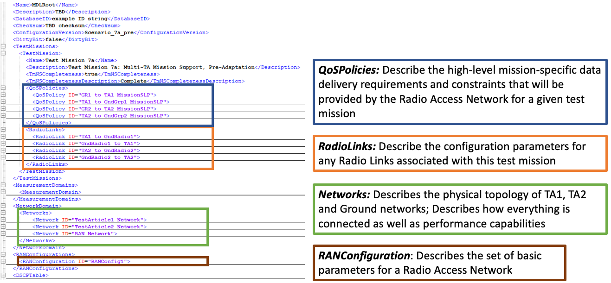

---

# Network Load Sharing (Before)

- TA1/GR1 is allocated 5 Mb/s bandwidth – combined uplink and downlink configuration
- Voice: 150Kb/s (75Kb/s downlink and 75Kb/s uplink)
- Safety: 250Kb/s (250Kb/s downlink and 0Kb/s uplink)
- Bulk: 4,500Kb/s (4,000Kb/s downlink and 1,000Kb/s uplink)

---

# GR1/TA1 Uplink and Downlink Voice Traffic (Before)

---

# GR1/TA1 Uplink and Downlink Safety Traffic (Before)

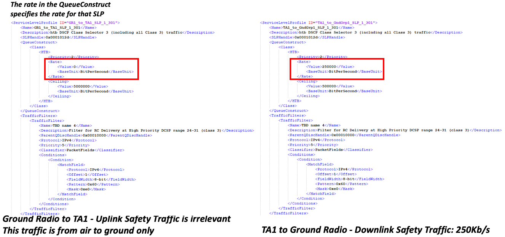

---
# GR1/TA1 Uplink and Downlink Bulk Traffic (Before)

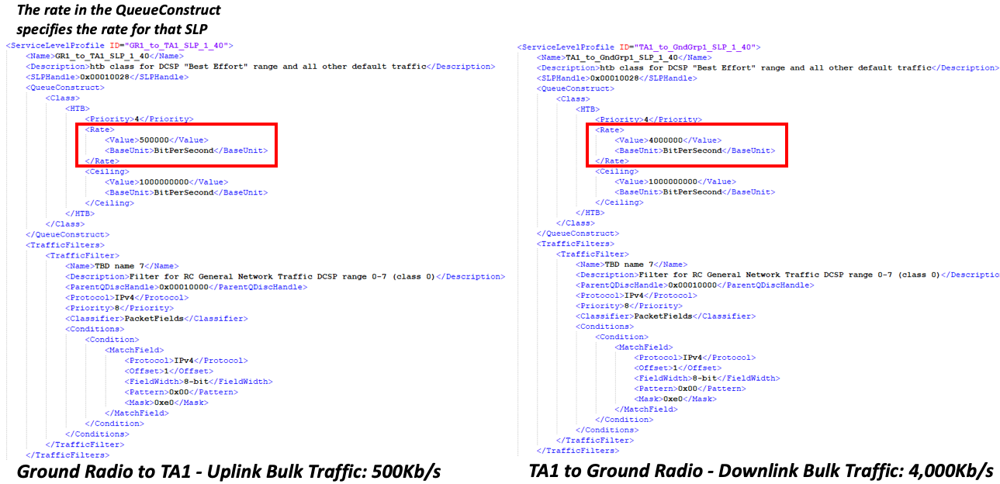

---
# Similar for GR2/TA2 Uplink and Downlink 

- TA2/GR2 are also using 5 Mb/s combined bandwidth (for simplicity, TA2 is using a symmetric use of the network loads)
   - Voice: 150Kb/s (75Kb/s downlink and 75Kb/s uplink) --> critical data 
   - Safety: 250Kb/s (250Kb/s downlink and 0Kb/s uplink) --> critical data for downlink 
   - Bulk: 4,500Kb/s (4,000Kb/s downlink and 500Kb/s uplink)
   
---

# GR/TA2 Uplink and Downlink Voice Traffic (Before)

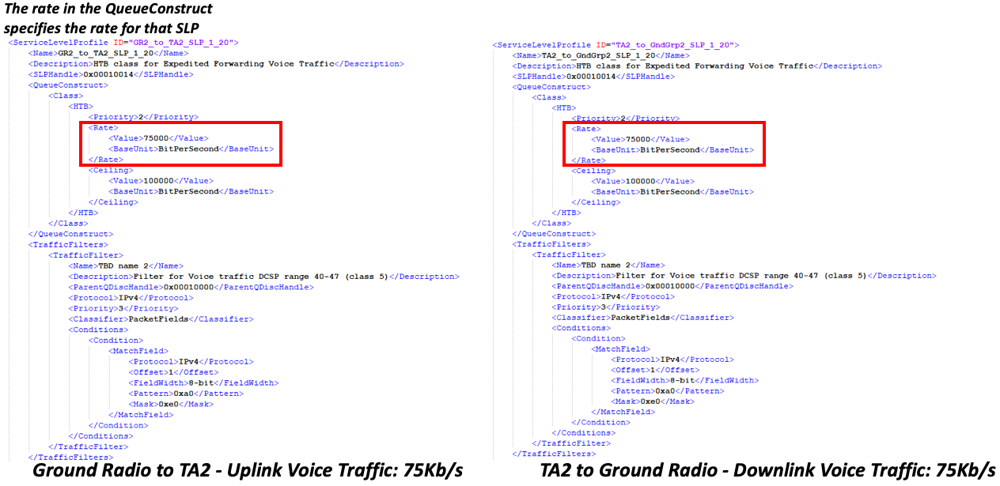

---
# GR/TA2 Uplink and Downlink Safety Traffic (Before)

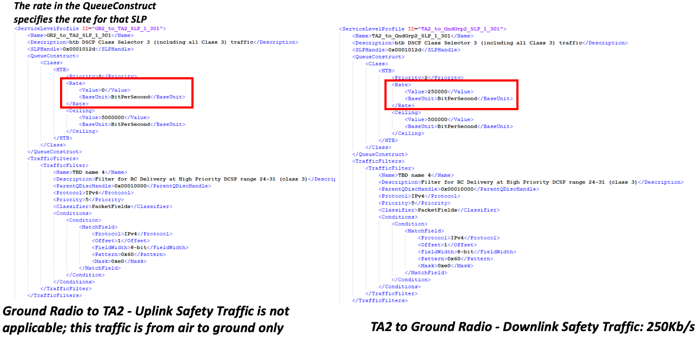

---
# GR/TA2 Uplink and Downlink Bulk Traffic (Before)

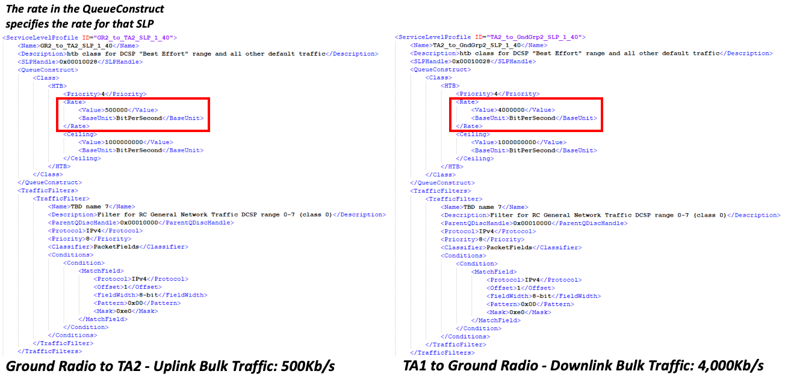

---

# Radio Link Description in MDL

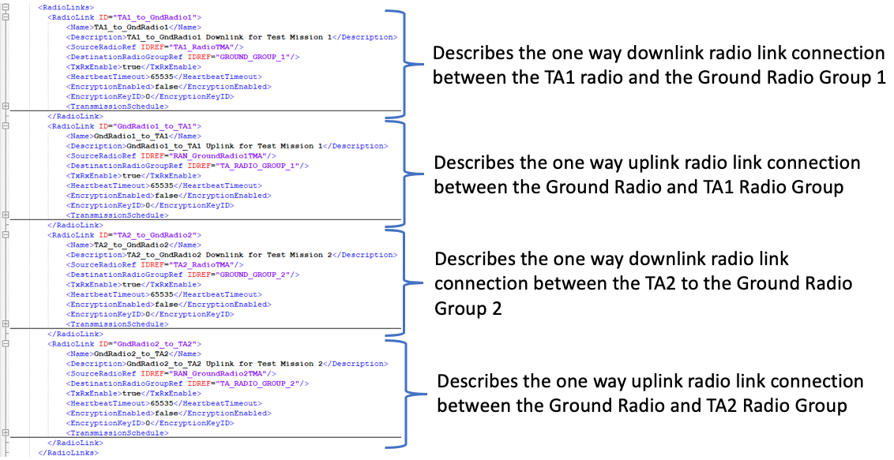

---

# Network Description in MDL

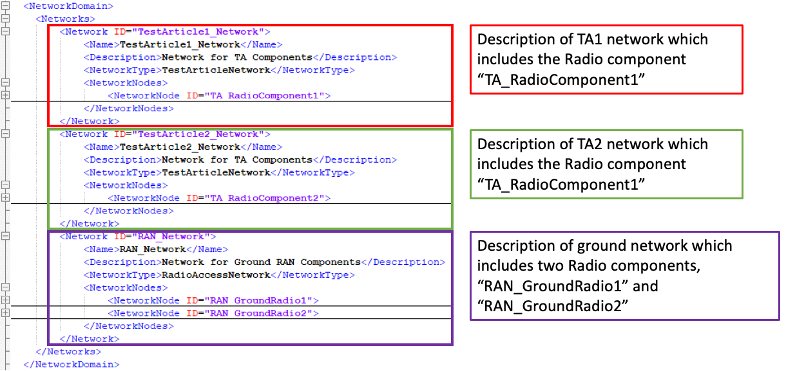

---

# After TA1 is Grounded

- Bandwidth available to TA2/GR2: 10 Mb/s
- Because of the additional bandwidth available, TA2 can perform different tests that have greater minimum data requirements
    - TA2/GR2 will need to be reconfigured to use the entire available bandwidth of 10 Mb/s
    - System Manager has the role to reconfigure both TA2 and GR2 radios to adapt

---

# Network Load Sharing Adaptation

- TA2/GR2 are allocated 10 Mb/s bandwidth (combined)
    - Voice: 150Kb/s (75Kb/s downlink and 75Kb/s uplink)
        - No changes
	- Safety: 600Kb/s (600Kb/s downlink and 0Kb/s uplink) 
		- New test points require additional Safety-of-Flight data
	- Bulk: 9,000Kb/s (8,000Kb/s downlink and 1,000Kb/s uplink) 
		- We want to bring more data down to take advantage of the bandwidth

---

# GR/TA2 Uplink and Downlink Voice Traffic (Adaption)

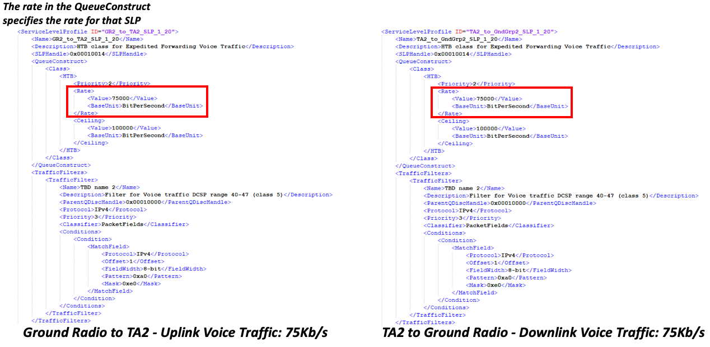

---
# GR/TA2 Uplink and Downlink Safety Traffic (Adaptation)

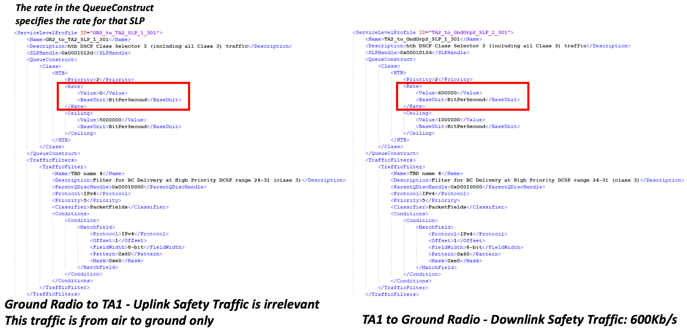

---
# GR/TA2 Uplink and Downlink Bulk Traffic (Adaptation)

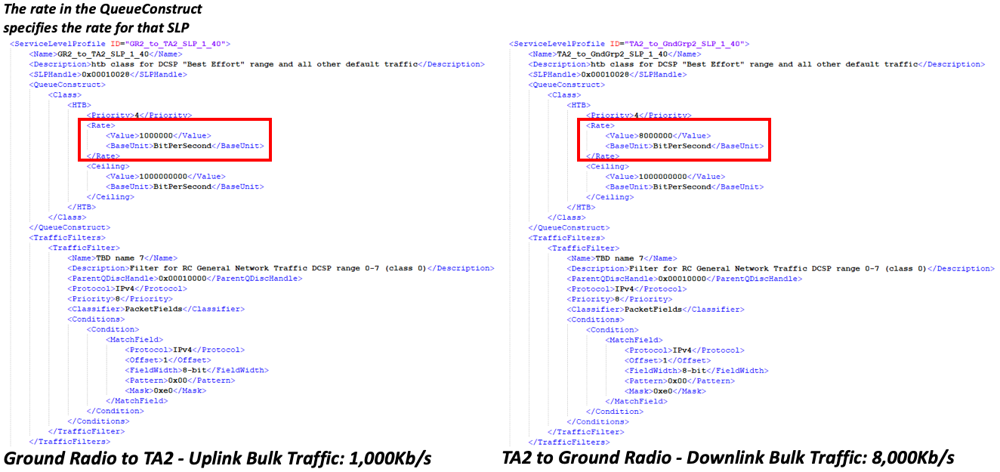
