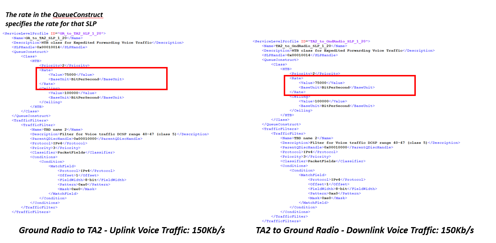

title: FT Scenario 7
class: animation-fade
layout: true
<!-- This slide will serve as the base layout for all your slides -->

.bottom-bar[
  {{title}}
]

---

class: impact

# {{title}}
## F-35 Testers Wrap up Weapons Delivery Accuracy Tests
### Adapted from a flight test that occurred in 2017 in F-35 Lightning flight testing at China Lake, CA

---

# Brief Description
.col-8[
This scenario describes a situation that involves two test articles initially sharing the same frequency for their missions. Suddenly TA1 is grounded and leaves the other aircraft (TA2) with more bandwidth for the next 30 minutes.
The goal is for the airborne aircraft (TA2) to take advantage of the extra bandwidth to conduct more tests.
.col-4[

]

---

# Test Article

.col-4[
Aircraft: F-35
]

.col-8[

]

---

# Range Infrastructure

.col-6[
- Range Network: 
	- aval Air Weapon System at China Lake, CA
- Equipment Used:
	- Ground Station Tracking Antenna and related network infrastructure
	- MCR Processing live data
	- Link Manager
- Equipment Available:
	- All in use
]

.col-6[

]

---
# Flight Test Operation Flow

---

# Dynamic Scheduling

- This mission depicts a scenario that contains a Link Manager (LM)
  - LM is responsible for coordinating the operation of multiple RF Links within a single RF Network 
  - LM utilizes many standardized interfaces defined in IRIG 106-17 Chapters 21 through 28
- LM provides a way to dynamically allocate capacity to radio link to achieve desired QoS guarantees
	- System Manager application provides access to LM and the ability to transmit schedule dynamically for the radios whose links it is managing 
- Primary operation of LM is to coordinate RF Link control, status, and throughput sharing across multiple RF Links 
	- LM exchanges RF Network Messages (RFNMs) with the link agent interface of each radio associated with the RF Links that the LM manages
		- Message shapes (IRIG 106-17 Chapters 24)
---

# Associated Constraints

- Physical limit on amount of bandwidth that can be achieved
- Minimum Capacity used to guarantee transmission of critical data; it must be large enough to accommodate critical data loads
- Assured Capacity constraints is the physical amount of the bandwidth; it is its guaranteed capacity if needed; less or = than the physical limit of the bandwidth
- Assured Capacity must greater or equal to the minimum capacity

---

# Requirements

- Voice, Safety and RFNM (messages between the LM and the Radios) need to be our critical data
- LM provides dynamic schedules 
- Bandwidth available: 10 Mb/s
    - TA1 is allocated 5 Mb/s 
    - TA2 is allocated 5 Mb/s
    - When TA1 is grounded then TA2 and LM will need to be reconfigured to reallocate all bandwidth to TA2.
- latency requirement: 100 ms

---

# Test Mission Description in MDL

---

# Network Load Sharing (Before)

- TA1 is allocated 5 Mb/s bandwidth – uplink and downlink configuration
- Voice: 150Kb/s (75Kb/s downlink and 75Kb/s uplink)
- Safety: 100Kb/s (100Kb/s downlink and 0Kb/s uplink)
- Bulk: 4,622Kb/s (4,622Kb/s downlink and 0Kb/s uplink) 
- RFNM: 64Kb/s (32Kb/s downlink and 32Kb/s uplink) 

---

# GR/TA1 Uplink and Downlink Voice Traffic (Before)

---

# GR/TA1 Uplink and Downlink Safety Traffic (Before)

---
# GR/TA1 Uplink and Downlink Bulk Traffic (Before)

---
# GR/TA1 Uplink and Downlink RFNM Traffic (Before)

---
# Similar for GR/TA2 Uplink and Downlink 

- TA2 is also using 5 Mb/s bandwidth (for simplification TA2 is using a symmetric use of the network loads)
   - Voice: 150Kb/s (75Kb/s downlink and 75Kb/s uplink) --> critical data 
   - Safety: 100Kb/s (100Kb/s downlink and 0Kb/s uplink) --> critical data for downlink 
   - Bulk: 4,622Kb/s (4,622Kb/s downlink and 0Kb/s uplink)
   - RFNM: 64Kb/s (32Kb/s downlink and 32Kb/s uplink) --> critical data
---

# GR/TA2 Uplink and Downlink Voice Traffic (Before)

---
# GR/TA2 Uplink and Downlink Safety Traffic (Before)

---
# GR/TA2 Uplink and Downlink Bulk Traffic (Before)

---
# GR/TA2 Uplink and Downlink RFNM Traffic (Before)

---
# GR/TA1 Assured Capacity

---

# GR/TA2 Assured Capacity

---

# Radio Link Description in MDL

---

# Elements Used to Configure the Link Manager 

---

# Network Description in MDL

---

# Air Information Bit Rate

---

# After TA1 is Grounded

- Voice, Safety and RFNM need to be guarantee
- Bandwidth available: 10 Mb/s
    - TA2 can use 10 Mb/s to take advantage of the situation
    - When TA1 is grounded then TA2 will need to be reconfigured to use the entire bandwidth available 10 Mb/s
    - System Manager has the role to reconfigure Link Manager to adapt 
- Dynamic Schedule by Link Manager

---
# GR/TA2 Assured Capacity Adaptation

---
# Network Load Sharing Adaptation

- TA2 is allocated 10 Mb/s bandwidth
    - Voice: 150Kb/s (75Kb/s downlink and 75Kb/s uplink)
        - No changes
	- Safety: 542Kb/s (542Kb/s downlink and 0Kb/s uplink) 
		- We want more safety data sent from TA2 to GR to take advantage of the bandwidth
	- Bulk: 9,244Kb/s (9,244Kb/s downlink and 0Kb/s uplink) 
		- We want to bring more data down to take advantage of the bandwidth
	- RFNM: 64Kb/s (32Kb/s downlink and 32Kb/s uplink)
		- No changes

---

# GR/TA2 Uplink and Downlink Voice Traffic (Adaption)

---
# GR/TA2 Uplink and Downlink Safety Traffic (Adaptation)

---
# GR/TA2 Uplink and Downlink Bulk Traffic (Adaptation)

---
# GR/TA2 Uplink and Downlink RFNM Traffic (Adaptation)

